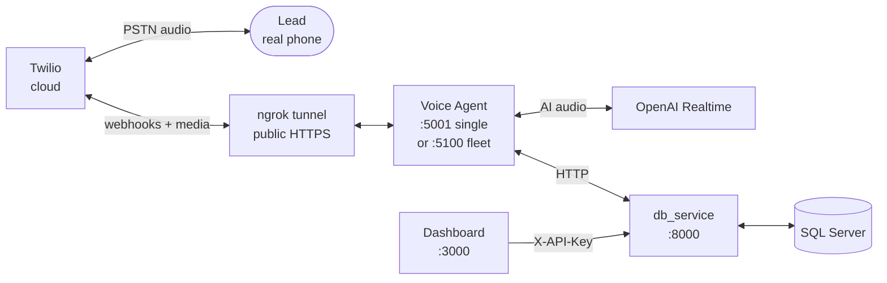

<div align="center">

# Outvox

**Open-source outbound voice and SMS platform.**
Live AI phone conversations on Twilio, powered by OpenAI Realtime.

[](LICENSE)
[](https://github.com/bittoby/Outvox/actions/workflows/ci.yml)
[](https://www.python.org/)
[](https://nodejs.org/)
[](CONTRIBUTING.md)


</div>

> **Read [`DISCLAIMER.md`](DISCLAIMER.md) and [`SECURITY.md`](SECURITY.md) before placing real calls.**
> Outvox automates outbound calls and SMS. TCPA, FCC, CTIA and carrier rules apply.
> The maintainers make **no claim of compliance** — the operator carries the legal risk.

---

## What is Outvox?

Outvox is a self-hostable platform for running **AI-driven outbound voice and SMS campaigns**. When you start a call, an **OpenAI Realtime** voice agent holds a live, two-way conversation with your lead, bridged through **Twilio** over the regular phone network. SMS works the same way — your stored templates go out through Twilio and replies (YES, STOP, photos) flow back in.

### Features

- **Live AI voice calls** — OpenAI Realtime over Twilio Media Streams.
- **SMS campaigns** — templates, batches, rate limiting, YES/STOP consent tracking, photo capture.
- **Lead management** — CSV import/export, store routing, DNC flags.
- **Concurrent fleet** — up to 10 voice agents behind Nginx for parallel calls.
- **Operator dashboard** — React SPA for live monitoring, history, and analytics.
- **Fully white-labelable** — company name, agent persona and copy are env-driven.

### How it works



You run four things on your machine: the **database service**, one or more **voice agents**, the **dashboard**, and an **ngrok tunnel** so Twilio's cloud can reach your local agent. Twilio handles the actual phone network; OpenAI handles the AI conversation; Outvox is the glue.

<details>
<summary><strong>New here? Quick vocabulary</strong></summary>

| Term | What it means in Outvox |
| --- | --- |
| **Twilio** | Cloud telephony provider. Sends/receives SMS and places real phone calls for you. |
| **OpenAI Realtime** | OpenAI's low-latency speech-to-speech model. Listens to the lead and talks back in real time. |
| **Voice Agent** | A small FastAPI server (`BE/outbound_main.py`) that bridges a Twilio call to OpenAI Realtime. |
| **`db_service`** | A separate FastAPI server (`BE/db_service.py`) that owns the database. Everything else talks to it over HTTP. |
| **Dashboard** | The React app in `FE/`. Where operators manage leads, campaigns, phone numbers, and settings. |
| **Webhook** | An HTTP endpoint Twilio calls when something happens (SMS arrives, call connects). Outvox exposes `/twilio-sms` and `/twilio-voice`. |
| **ngrok** | A tunnel that gives your `localhost` a public HTTPS URL so Twilio can reach it. Free tier is fine. |
| **TwiML** | Twilio's XML scripting language. Outvox returns TwiML telling Twilio to bridge call audio to our WebSocket. |
| **DNC** | Do Not Call. Leads marked DNC are skipped permanently. |
| **TCPA / 10DLC** | US laws and carrier rules covering automated calls/SMS. See [`DISCLAIMER.md`](DISCLAIMER.md). |

</details>

---

## Choose your path

| I want to... | Time | Go to |
| --- | --- | --- |
| **Try the demo** with no credentials — just see the dashboard | ~5 min | [Demo mode](#demo-mode-no-credentials) |
| **Run it locally** with my own Twilio + OpenAI keys (single agent — most users start here) | ~20 min | [Quick start](#quick-start) |
| **Scale to 10 concurrent calls** with the Docker fleet | +10 min on top of Quick start | [Scale-up: 10-agent fleet](#scale-up-10-agent-fleet) |
| **Deploy this for real** with hardening | — | [`SECURITY.md`](SECURITY.md) |

> **Single agent or fleet?** Each voice agent handles roughly one concurrent call. If you need more parallel calls, run the fleet. The setup is otherwise identical — the only difference is which port ngrok tunnels to (5001 vs 5100). Start with a single agent first.

---

## Demo mode (no credentials)

The fastest way to see Outvox running. Boots a stack with mock OpenAI and Twilio — no API keys required, no real calls placed.

```bash
git clone https://github.com/bittoby/Outvox.git
cd Outvox
docker compose -f docker-compose.demo.yml up --build
```

Then open:

- **Dashboard** — <http://localhost:3000>
- **API docs** — <http://localhost:8000/docs>

Demo mode is for "is this thing alive?" verification — it does **not** exercise real production routes. Move to [Quick start](#quick-start) when you're ready to wire in real services.

---

## Quick start

This is the **single-agent local setup**. Plan for about 20 minutes if you already have Twilio and OpenAI accounts. If you want concurrent calls, finish this section first, then jump to [Scale-up: 10-agent fleet](#scale-up-10-agent-fleet).

### 1. Prerequisites

| Required | Version / Notes |
| --- | --- |
| Python | 3.11, 3.12, or 3.13 (3.14 is not yet supported by pinned dependencies) |
| Node.js | 18 or newer |
| SQL Server | 2019+ (or LocalDB / a Docker container — covered in step 5) |
| ODBC Driver 18 for SQL Server | See [troubleshooting](#troubleshooting) if `pyodbc` complains |
| Docker | Optional — only needed for the demo or the 10-agent fleet |
| Twilio account | A Voice/SMS-capable US phone number |
| OpenAI API key | Must have Realtime access |
| ngrok (or similar) | Free tier is fine. Sign up at [ngrok.com](https://ngrok.com) |

### 2. Clone and install

```bash
git clone https://github.com/bittoby/Outvox.git
cd Outvox
```

Then install all dependencies (backend, frontend, tests) with one command:

**Linux / macOS**

```bash
make install
```

**Windows (PowerShell)**

```powershell
.\dev.ps1 install
```

<details>
<summary>Or install manually if the task runners don't fit your setup</summary>

```bash
# Backend + tests share a single .venv at the repo root
python3.12 -m venv .venv          # or 3.11 / 3.13
source .venv/bin/activate         # Windows: .\.venv\Scripts\Activate.ps1
pip install -r BE/requirements.txt
pip install -r tests/requirements.txt
cp BE/env.example BE/.env         # Windows: Copy-Item BE\env.example BE\.env

# Frontend
cd FE
cp env.example .env
npm install
```

</details>

### 3. Fill in `BE/.env`

The installer copied `BE/env.example` to `BE/.env` for you. Open it and set at least these values:

```env
# Dashboard ↔ backend auth — generate one with:
#   python -c "import secrets; print(secrets.token_urlsafe(48))"
API_KEY=your-strong-random-key

# OpenAI (must have Realtime access)
OPENAI_API_KEY=sk-...

# Twilio (find these in https://console.twilio.com/)
TWILIO_ACCOUNT_SID=AC...
TWILIO_AUTH_TOKEN=...

# We'll fill these in during step 6 once ngrok is running.
PUBLIC_WEBHOOK_BASE_URL=https://your-subdomain.ngrok.app
NGROK_HOST=your-subdomain.ngrok.app

# Database — defaults work with the Docker SQL Server in step 5
DATABASE_BACKEND=sqlserver
SQLServer=localhost,1433
SQLDatabase=outvox
SQLUser=sa
SQLPassword=YourStrong!Passw0rd

# Brand — every customer-facing word the AI agent says
COMPANY_NAME=Your Company
AGENT_NAME=Alex
```

Then open `FE/.env` and set the same key so the dashboard can authenticate against the backend:

```env
VITE_API_KEY=your-strong-random-key   # same value as API_KEY above
```

See [`BE/env.example`](BE/env.example) for every supported variable and what it does.

### 4. Start SQL Server (skip if you already have one)

If you don't already have SQL Server running locally, this Docker one-liner is the easiest path:

```bash
docker run --name outvox-sqlserver \
  -e ACCEPT_EULA=Y \
  -e MSSQL_SA_PASSWORD='YourStrong!Passw0rd' \
  -p 1433:1433 \
  -d mcr.microsoft.com/mssql/server:2022-latest
```

Outvox creates its own database and tables on first start — you don't need to run any migrations.

### 5. Expose your machine to Twilio with ngrok

Twilio's servers live in the cloud and **cannot reach `localhost`**. ngrok solves this by giving your local voice agent a public HTTPS URL.

**Start the tunnel** in its own terminal. Point it at port **5001** (where the voice agent will run):

```bash
ngrok http 5001
# Or, with a reserved subdomain so the URL stays stable across restarts:
ngrok http 5001 --domain=your-subdomain.ngrok.app
```

ngrok prints a forwarding line like `https://your-subdomain.ngrok.app -> http://localhost:5001`. Copy that HTTPS URL.

**Update `BE/.env`** with what ngrok gave you:

```env
PUBLIC_WEBHOOK_BASE_URL=https://your-subdomain.ngrok.app
NGROK_HOST=your-subdomain.ngrok.app
```

| Variable | What it's for |
| --- | --- |
| `PUBLIC_WEBHOOK_BASE_URL` | Lets Outvox verify Twilio's signature on incoming webhooks. Must match the public URL Twilio actually calls. |
| `NGROK_HOST` | The host Outvox embeds in `webhook_url` when *placing* outbound calls (so Twilio knows where to call back). |

**Configure your Twilio number** in the [Twilio console](https://console.twilio.com/) → *Phone Numbers → Active Numbers → (click your number)*:

| Twilio console field | Value | Method |
| --- | --- | --- |
| **Messaging — A MESSAGE COMES IN** | `https://your-subdomain.ngrok.app/twilio-sms` | HTTP POST |
| **Voice — A CALL COMES IN** *(only if you accept inbound calls)* | `https://your-subdomain.ngrok.app/twilio-voice` | HTTP POST |

Save. You're now ready to receive inbound SMS and place outbound calls.

> **Important:** Outvox rejects unsigned Twilio requests by default. If you see `403 Invalid Twilio signature` later in the agent logs, `PUBLIC_WEBHOOK_BASE_URL` doesn't match the URL Twilio actually called — fix the env var and restart the agent. Don't disable signature validation in production.

### 6. Run the three services

Open three more terminals (you should have ngrok in a fourth one from step 5):

```bash
# Terminal 1 — Database service on port 8000
make dev-be                              # or: cd BE && python db_service.py

# Terminal 2 — Voice agent on port 5001 (this is what ngrok tunnels to)
cd BE && AGENT_ID=OUT1 PORT=5001 python outbound_main.py

# Terminal 3 — React dashboard on port 3000
make dev-fe                              # or: cd FE && npm run dev
```

On Windows, replace `make dev-be` / `make dev-fe` with `.\dev.ps1 dev-be` / `.\dev.ps1 dev-fe`.

Wait until you see all three are healthy:

- `db_service`: `Uvicorn running on http://0.0.0.0:8000`
- `outbound_main`: `[OUT1] Starting service on port 5001`
- `vite`: `Local: http://localhost:3000/`

Open <http://localhost:3000> — you should see the Outvox dashboard.

### 7. Make your first call

Time to verify everything works end-to-end. We'll register your Twilio number and place one real call.

1. **Register the phone number.** In the dashboard, go to **Phone Numbers → + Add Number**. Paste your Twilio number (`+15551234567` or any common US format) and click *Add Number*.
2. **Add a test lead.** Go to **Leads → + Add Lead** and enter your own mobile number as a single lead (you'll be the one getting the call). You can also use the CLI:
   ```bash
   python BE/scripts/call_manager.py add-lead +15551234567 "Test Lead"
   ```
3. **Place the call.** From the dashboard, open the lead and click **Call**. Or from the CLI:
   ```bash
   python BE/scripts/call_manager.py single-call
   ```
4. **Watch the logs.** In the voice agent terminal, you should see Twilio's webhook arrive (`POST /twilio-voice`), TwiML go out, and the OpenAI Realtime media stream open. Your phone rings.

If the call doesn't connect, head to [Troubleshooting](#troubleshooting) — the first three entries cover ~90% of first-time issues.

### 8. Seed sample data (optional)

If you want a fuller dashboard for screenshots or demos:

```bash
cd BE
python scripts/setup_stores.py           # three sample stores
python scripts/setup_templates.py        # 15 carrier-safe SMS templates
```

---

## Scale-up: 10-agent fleet

The single agent in Quick start handles ~1 concurrent call. To run many calls in parallel, swap that one agent for a Docker stack of 10 agents behind an Nginx load balancer.

**Everything from Quick start still applies** — the database service, dashboard, env file, Twilio console, and ngrok all stay the same. The only differences are:

- Instead of running `python outbound_main.py` directly, you run `docker compose up`.
- ngrok tunnels to **5100** (Nginx) instead of **5001** (single agent).

**Start the fleet** from the repo root:

```bash
cd BE
docker compose up -d --build
```

| Service | Port |
| --- | --- |
| Nginx load balancer | `5100` |
| Voice agents (1–10) | `5101`–`5110` (internal — Nginx routes to whichever is healthy) |
| Database service | `8000` (still run on the host, not in the compose stack) |

> The compose file deliberately does **not** include `db_service` — it runs on your host and the agents reach it via `host.docker.internal:8000`.

**Point ngrok at the load balancer:**

```bash
ngrok http 5100 --domain=your-subdomain.ngrok.app
```

Your `PUBLIC_WEBHOOK_BASE_URL` and the Twilio console webhooks **do not change** — only the local port ngrok forwards to.

**Operating the fleet:**

```bash
docker compose logs -f                   # all agents + nginx
docker compose logs -f outvox-agent1     # one agent
docker compose ps                        # health status
docker compose down                      # stop everything
```

---

## Architecture notes

The diagram is at the [top of this README](#how-it-works). A few design choices worth knowing:

- **Voice agents are stateless.** Only `db_service` touches the database, so the database driver lives in one place. Agents can be killed and restarted freely.
- **Everything customer-facing is env-driven.** Company name, agent persona, product list — no hard-coded tenant data anywhere in the code.
- **SQL Server is the supported runtime.** Postgres bootstrap exists for migration work but isn't production-ready yet. See [`SECURITY.md`](SECURITY.md).
- **Two FastAPI processes, not one.** `db_service` (port 8000) owns the database; the voice agent(s) (port 5001 or 5100) own the call logic. They communicate over HTTP, never share memory.

---

## Project structure

```
Outvox/
├── BE/                       Backend — FastAPI, Python 3.11–3.13
│   ├── core/                 Auth, schema, error handling, DB helpers
│   ├── models/               Pydantic models
│   ├── repositories/         Data access (pyodbc)
│   ├── services/             Business logic
│   ├── routers/              HTTP + WebSocket routes
│   ├── workers/              Background jobs
│   ├── utils/                Validators, parsers, prompt loader
│   ├── prompts/              AI prompt fixtures
│   ├── scripts/              Operator scripts (seed data, CLI, admin tools)
│   ├── db_service.py         Database service (port 8000)
│   └── outbound_main.py      Voice agent (port 5001)
├── FE/                       Frontend — React 18 + TypeScript + Vite
├── tests/                    Pytest test suite
├── dev.ps1                   Windows task runner
├── Makefile                  Linux/macOS task runner
├── pyproject.toml            Python project config
├── docker-compose.demo.yml   Credential-free demo stack
└── .github/workflows/        CI pipelines
```

---

## Common tasks

A cross-platform task runner lives at the repo root.

| Task | Linux / macOS | Windows |
| --- | --- | --- |
| Install everything | `make install` | `.\dev.ps1 install` |
| Start backend (db_service) | `make dev-be` | `.\dev.ps1 dev-be` |
| Start frontend | `make dev-fe` | `.\dev.ps1 dev-fe` |
| Run backend tests | `make test` | `.\dev.ps1 test` |
| Type-check frontend | `make typecheck` | `.\dev.ps1 typecheck` |
| Lint frontend | `make lint` | `.\dev.ps1 lint` |
| Build frontend for production | `make build` | `.\dev.ps1 build` |

Run `make help` (or `.\dev.ps1 help`) to see every target.

### Operator CLI

`BE/scripts/call_manager.py` is a small CLI for runtime operations:

```bash
python BE/scripts/call_manager.py stats              # daily statistics
python BE/scripts/call_manager.py health             # agent + LB health
python BE/scripts/call_manager.py single-call        # place one call
python BE/scripts/call_manager.py campaign 100       # parallel campaign over 100 leads
python BE/scripts/call_manager.py add-lead +15551234567 "Jane Doe"
python BE/scripts/call_manager.py mark-dnc +15551234567
```

---

## Testing

```bash
make test          # or: pytest
```

CI ([`.github/workflows/ci.yml`](.github/workflows/ci.yml)) runs the backend test suite on Python 3.11 and 3.12, plus the frontend type-check, lint, and production build on every pull request.

The suite covers DNC detection, phone validation, SMS template rendering, media-stream tokens, consent classification, agent-ID normalization, and SQL Server connection-string assembly. Integration tests against real Twilio / OpenAI / SQL Server are **not** part of CI yet — a great place to contribute.

---

## Troubleshooting

<details>
<summary><strong>Dashboard shows 401 Unauthorized</strong></summary>

Your backend has `API_KEY` set but the frontend isn't sending the matching value. Either:

- Set `VITE_API_KEY` in `FE/.env` (same value as `API_KEY` in `BE/.env`) and restart `npm run dev`, **or**
- Open the browser console on the dashboard and run `setApiKey("your-key")` — it persists in `localStorage`.

</details>

<details>
<summary><strong>Twilio webhooks aren't reaching my backend</strong></summary>

Twilio can't talk to `localhost`. You need an ngrok tunnel, matching `PUBLIC_WEBHOOK_BASE_URL` / `NGROK_HOST` env vars, and the Twilio console pointing at `/twilio-voice` and `/twilio-sms`. Full walk-through: [step 5 of Quick start](#5-expose-your-machine-to-twilio-with-ngrok).

Quick checks:

- ngrok forwards to **5001** (single agent) or **5100** (Docker fleet) — *never* 8000 (that's the DB service, not the webhook endpoint).
- `PUBLIC_WEBHOOK_BASE_URL` exactly matches your ngrok HTTPS URL (no trailing slash).
- Agent logs show `403 Invalid Twilio signature` → the URL Twilio called doesn't match `PUBLIC_WEBHOOK_BASE_URL`.
- Agent logs show nothing at all → Twilio console webhook URL is wrong, or ngrok isn't running, or the agent is down.

</details>

<details>
<summary><strong>pyodbc can't find the SQL Server driver</strong></summary>

Install Microsoft ODBC Driver 18:

- **macOS** — `brew tap microsoft/mssql-release && brew install msodbcsql18`
- **Ubuntu / Debian** — see [Microsoft's instructions](https://learn.microsoft.com/sql/connect/odbc/linux-mac/installing-the-microsoft-odbc-driver-for-sql-server)
- **Windows** — [download installer](https://learn.microsoft.com/sql/connect/odbc/download-odbc-driver-for-sql-server)

</details>

<details>
<summary><strong>"Configuration errors: OPENAI_API_KEY is required" on startup</strong></summary>

You haven't filled in `BE/.env`. Copy `env.example` to `.env` and add your real credentials. The validator skips this check for setup scripts and workers — only the main services require it.

</details>

<details>
<summary><strong>pip fails to build pydantic_core or asyncpg on Windows</strong></summary>

You're probably on Python 3.14. The pinned dependencies have prebuilt wheels for Python 3.11–3.13 only. Install a supported version:

```powershell
winget install -e --id Python.Python.3.12
```

Then `.\dev.ps1 clean; .\dev.ps1 install`. The dev runner detects 3.12 automatically.

</details>

<details>
<summary><strong>Settings page returns 401 but other pages work</strong></summary>

Fixed in the current release — the Settings page used to call the API with native `fetch`, which doesn't pick up the `X-API-Key` header that axios installs. Pull the latest `main` and refresh the page. If you're on a fork and seeing this, make sure `FE/src/services/api/settings.ts` and `FE/src/pages/SettingsPage.tsx` go through axios, not `fetch`.

</details>

---

## Production checklist

Before any internet-facing deployment, work through:

1. **[`SECURITY.md`](SECURITY.md)** — set `API_KEY`, tighten CORS, validate Twilio signatures, restrict the database service to an internal network.
2. **[`DISCLAIMER.md`](DISCLAIMER.md)** — TCPA, FCC, CTIA, state mini-TCPAs, carrier 10DLC, calling hours, DNC scrubbing — these are **your responsibility**.
3. Replace the placeholder `LoginPage` with real operator authentication.
4. Cover your campaign flows with integration tests against a staging Twilio account.

---

## Contributing

Contributions of all sizes are welcome — bug fixes, tests, docs, features.

1. Read [`CONTRIBUTING.md`](CONTRIBUTING.md) for the layering rules (routers → services → repositories) and the no-hard-coded-tenant-data policy.
2. Open an issue first for anything non-trivial.
3. Run `make test` before submitting.
4. Be excellent to one another — [`CODE_OF_CONDUCT.md`](CODE_OF_CONDUCT.md).

Security vulnerabilities should be reported privately through the channel in [`SECURITY.md`](SECURITY.md) — not public issues.

---

## License

Outvox is released under the **Apache License 2.0**.
See [`LICENSE`](LICENSE) and [`NOTICE`](NOTICE).

---

<div align="center">
<sub>Built for operators who want full control of their outbound calling stack.</sub>
</div>
