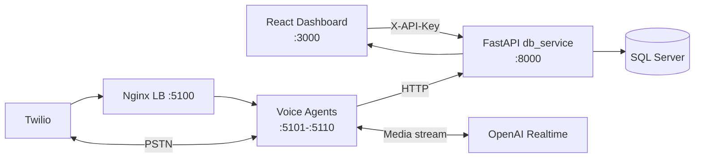

<div align="center">

# Outvox

**Open-source outbound voice and SMS platform.**
Live AI phone conversations on Twilio, powered by OpenAI Realtime.

[](LICENSE)
[](https://github.com/bittoby/Outvox/actions/workflows/ci.yml)
[](https://www.python.org/)
[](https://nodejs.org/)
[](CONTRIBUTING.md)


</div>

> **Read [`DISCLAIMER.md`](DISCLAIMER.md) and [`SECURITY.md`](SECURITY.md) before placing real calls.**
> Outvox automates outbound calls and SMS. TCPA, FCC, CTIA and carrier rules apply.
> The maintainers make **no claim of compliance** — the operator carries the legal risk.

---

## What is Outvox?

Outvox is a self-hostable platform for running **AI-driven outbound voice and SMS campaigns**. Each call is a live, two-way conversation between your lead and an OpenAI Realtime voice agent, bridged through Twilio.

**Features**

- **Live AI voice calls** — OpenAI Realtime over Twilio Media Streams.
- **SMS campaigns** — templates, batches, rate limiting, YES/STOP consent tracking.
- **Lead management** — CSV import/export, store routing, DNC flags.
- **Concurrent fleet** — up to 10 voice agents behind Nginx for parallel calls.
- **Operator dashboard** — React SPA for live monitoring, history, and analytics.
- **Fully white-labelable** — company name, agent persona and copy are env-driven.

---

## Choose your path

| I want to... | Go to |
| --- | --- |
| **Try it in 5 minutes** with no credentials | [Demo mode](#demo-mode-no-credentials) |
| **Run it locally** with my Twilio + OpenAI keys | [Quick start](#quick-start) |
| **Run the 10-agent fleet** in Docker | [Production fleet](#production-fleet-docker) |
| **Understand the architecture** | [Architecture](#architecture) |
| **Deploy this for real** | [`SECURITY.md`](SECURITY.md) — hardening checklist |

---

## Demo mode (no credentials)

The fastest way to see Outvox running. Boots a stack with mock OpenAI and Twilio — no API keys required, no real calls placed.

```bash
git clone https://github.com/bittoby/Outvox.git
cd Outvox
docker compose -f docker-compose.demo.yml up --build
```

Then open:

- **Dashboard** — <http://localhost:3000>
- **API docs** — <http://localhost:8000/docs>

Demo mode is for "is this thing alive?" verification — it does **not** exercise real production routes. Move to the [Quick start](#quick-start) when you're ready to wire in real services.

---

## Quick start

### 1. Prerequisites

| Required | Version |
| --- | --- |
| Python | 3.11+ |
| Node.js | 18+ |
| SQL Server | 2019+ (or LocalDB / containerized) |
| ODBC Driver 18 for SQL Server | latest |
| Docker | optional, only for the agent fleet |
| Twilio account | with a Voice/SMS-capable number |
| OpenAI API key | with Realtime access |
| ngrok or similar | for receiving Twilio webhooks locally |

### 2. Install

```bash
git clone https://github.com/bittoby/Outvox.git
cd Outvox
```

**Linux / macOS**

```bash
make install        # installs BE, FE and test dependencies
```

**Windows (PowerShell)**

```powershell
.\dev.ps1 install
```

<details>
<summary>Or install manually</summary>

```bash
# Backend
cd BE
cp env.example .env          # Windows: Copy-Item env.example .env
python -m venv .venv
source .venv/bin/activate    # Windows: .\.venv\Scripts\Activate.ps1
pip install -r requirements.txt

# Frontend
cd ../FE
cp env.example .env
npm install
```

</details>

### 3. Configure

Open `BE/.env` and set, at minimum:

```env
# Auth — generate with: python -c "import secrets; print(secrets.token_urlsafe(48))"
API_KEY=your-strong-random-key

# OpenAI
OPENAI_API_KEY=sk-...

# Twilio
TWILIO_ACCOUNT_SID=AC...
TWILIO_AUTH_TOKEN=...
PUBLIC_WEBHOOK_BASE_URL=https://your-tunnel.ngrok.app

# Database (SQL Server is the supported runtime)
DATABASE_BACKEND=sqlserver
SQLServer=localhost,1433
SQLDatabase=outvox
SQLUser=sa
SQLPassword=YourStrong!Passw0rd

# Brand — every customer-facing word the agent speaks
COMPANY_NAME=Your Company
AGENT_NAME=Alex
```

Then in `FE/.env` set the matching key so the dashboard can authenticate:

```env
VITE_API_KEY=your-strong-random-key
```

See [`BE/env.example`](BE/env.example) for every supported variable.

### 4. Start SQL Server (optional Docker shortcut)

If you don't already have SQL Server running:

```bash
docker run --name outvox-sqlserver \
  -e ACCEPT_EULA=Y \
  -e MSSQL_SA_PASSWORD='YourStrong!Passw0rd' \
  -p 1433:1433 \
  -d mcr.microsoft.com/mssql/server:2022-latest
```

Outvox creates its own tables on first start.

### 5. Run

Three terminals:

```bash
# 1. Database service (port 8000)
make dev-be                            # or: cd BE && python db_service.py

# 2. A voice agent (port 5001)
cd BE && AGENT_ID=OUT1 PORT=5001 python outbound_main.py

# 3. Frontend (port 3000)
make dev-fe                            # or: cd FE && npm run dev
```

Open <http://localhost:3000> and you're in.

### 6. Seed sample data (optional)

```bash
cd BE
python scripts/setup_stores.py        # three sample stores
python scripts/setup_templates.py     # 15 carrier-safe SMS templates
```

---

## Production fleet (Docker)

Run 10 voice-agent containers behind an Nginx load balancer.

```bash
cd BE
docker compose up -d --build
```

| Service | Port |
| --- | --- |
| Nginx load balancer | `5100` |
| Voice agents (1–10) | `5101`–`5110` |
| Database service | `8000` (run on the host) |

The compose file does **not** include `db_service` — run it on the host. Agents reach it via `host.docker.internal:8000`.

```bash
docker compose logs -f                 # all
docker compose logs -f outvox-agent1   # one agent
docker compose down                    # stop
```

---

## Architecture



**Key design choices**

- Voice agents are **stateless**; only `db_service` touches the database, so the database driver lives in one place.
- Every customer-facing string (company name, agent persona, products) is driven by `.env` — no hard-coded tenant data.
- **SQL Server** is the supported runtime. Postgres support is experimental — see [`SECURITY.md`](SECURITY.md).

---

## Project structure

```
Outvox/
├── BE/                    Backend — FastAPI, Python 3.11+
│   ├── core/              Auth, schema, error handling, DB helpers
│   ├── models/            Pydantic models
│   ├── repositories/      Data access (pyodbc)
│   ├── services/          Business logic
│   ├── routers/           HTTP + WebSocket routes
│   ├── workers/           Background jobs
│   ├── utils/             Validators, parsers, prompt loader
│   ├── prompts/           AI prompt fixtures
│   ├── scripts/           Operator scripts (seed data, CLI, admin tools)
│   ├── db_service.py      Database service (port 8000)
│   └── outbound_main.py   Voice agent (port 5001)
├── FE/                    Frontend — React 18 + TypeScript + Vite
├── tests/                 Pytest test suite
├── dev.ps1                Windows task runner
├── Makefile               Linux/macOS task runner
├── pyproject.toml         Python project config
├── docker-compose.demo.yml  Credential-free demo stack
└── .github/workflows/     CI pipelines
```

---

## Common tasks

The repo ships a cross-platform task runner. From the repo root:

| Task | Linux / macOS | Windows |
| --- | --- | --- |
| Install everything | `make install` | `.\dev.ps1 install` |
| Run backend tests | `make test` | `.\dev.ps1 test` |
| Type-check frontend | `make typecheck` | `.\dev.ps1 typecheck` |
| Lint frontend | `make lint` | `.\dev.ps1 lint` |
| Build frontend | `make build` | `.\dev.ps1 build` |
| Start backend | `make dev-be` | `.\dev.ps1 dev-be` |
| Start frontend | `make dev-fe` | `.\dev.ps1 dev-fe` |

Run `make help` to see every target.

### Operator CLI

`BE/scripts/call_manager.py` is a small CLI for runtime operations:

```bash
python BE/scripts/call_manager.py stats           # daily statistics
python BE/scripts/call_manager.py health          # agent + LB health
python BE/scripts/call_manager.py single-call     # place one call
python BE/scripts/call_manager.py campaign 100    # parallel campaign
python BE/scripts/call_manager.py add-lead +15551234567 "Jane Doe"
python BE/scripts/call_manager.py mark-dnc +15551234567
```

---

## Testing

```bash
make test          # or: pytest
```

Continuous integration ([`.github/workflows/ci.yml`](.github/workflows/ci.yml)) runs the backend test suite on Python 3.11 and 3.12, plus the frontend type-check, lint, and production build on every pull request.

The suite covers DNC detection, phone validation, SMS template rendering, media-stream tokens, consent classification, agent-ID normalization, and SQL Server connection-string assembly. Integration tests against real Twilio / OpenAI / SQL Server are **not** part of CI yet — they are a great place to contribute.

---

## Troubleshooting

<details>
<summary><strong>Dashboard shows 401 Unauthorized</strong></summary>

Your backend has `API_KEY` set but the frontend isn't sending it. Either:

- Set `VITE_API_KEY` in `FE/.env` and restart `npm run dev`, **or**
- Open the browser console and run `setApiKey("your-key")` — it persists in `localStorage`.

</details>

<details>
<summary><strong>Twilio webhooks aren't reaching my backend</strong></summary>

Twilio needs a public URL. Run an ngrok tunnel:

```bash
ngrok http 5100   # for the agent fleet, or 5001 for a single agent
```

Then set `PUBLIC_WEBHOOK_BASE_URL` in `BE/.env` to the HTTPS URL ngrok prints, and update your Twilio number's webhook in the Twilio console.

</details>

<details>
<summary><strong>pyodbc can't find the SQL Server driver</strong></summary>

Install Microsoft ODBC Driver 18:

- **macOS** — `brew tap microsoft/mssql-release && brew install msodbcsql18`
- **Ubuntu / Debian** — see [Microsoft's instructions](https://learn.microsoft.com/sql/connect/odbc/linux-mac/installing-the-microsoft-odbc-driver-for-sql-server)
- **Windows** — [download installer](https://learn.microsoft.com/sql/connect/odbc/download-odbc-driver-for-sql-server)

</details>

<details>
<summary><strong>"Configuration errors: OPENAI_API_KEY is required" on startup</strong></summary>

You haven't filled in `BE/.env`. Copy `env.example` to `.env` and add your real credentials. The validator skips this check for setup scripts and workers — only the main services require it.

</details>

---

## Production checklist

Before any internet-facing deployment, work through:

1. **[`SECURITY.md`](SECURITY.md)** — set `API_KEY`, tighten CORS, validate Twilio signatures, restrict the database service to an internal network.
2. **[`DISCLAIMER.md`](DISCLAIMER.md)** — TCPA, FCC, CTIA, state mini-TCPAs, carrier 10DLC, calling hours, DNC scrubbing — these are **your responsibility**.
3. Replace the placeholder `LoginPage` with real operator authentication.
4. Cover your campaign flows with integration tests against a staging Twilio account.

---

## Contributing

Contributions of all sizes are welcome — bug fixes, tests, docs, features.

1. Read [`CONTRIBUTING.md`](CONTRIBUTING.md) for the layering rules (routers → services → repositories) and the no-hard-coded-tenant-data policy.
2. Open an issue first for anything non-trivial.
3. Run `make test` before submitting.
4. Be excellent to one another — [`CODE_OF_CONDUCT.md`](CODE_OF_CONDUCT.md).

Security vulnerabilities should be reported privately through the channel in [`SECURITY.md`](SECURITY.md) — not public issues.

---

## License

Outvox is released under the **Apache License 2.0**.
See [`LICENSE`](LICENSE) and [`NOTICE`](NOTICE).

---

<div align="center">
<sub>Built for operators who want full control of their outbound calling stack.</sub>
</div>
